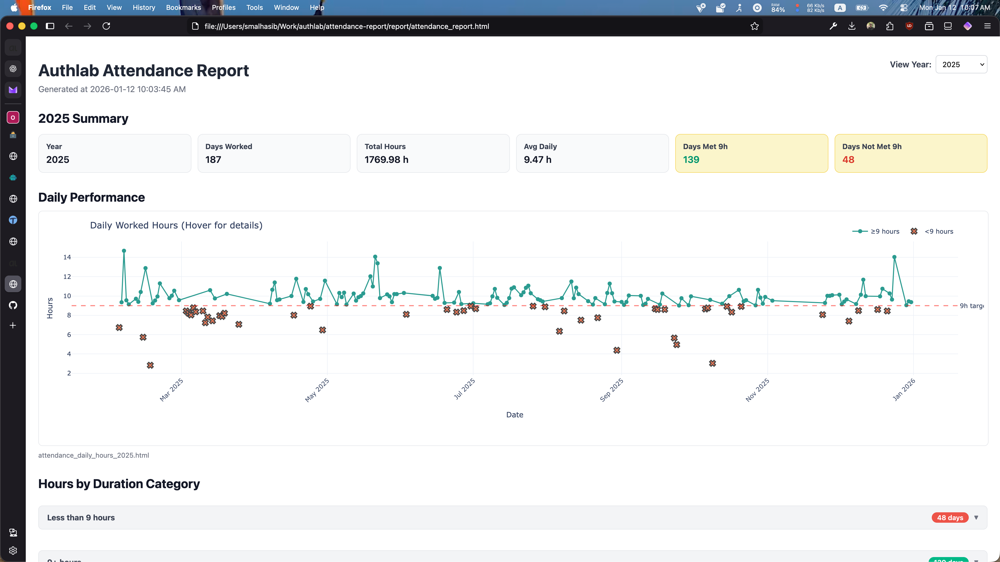
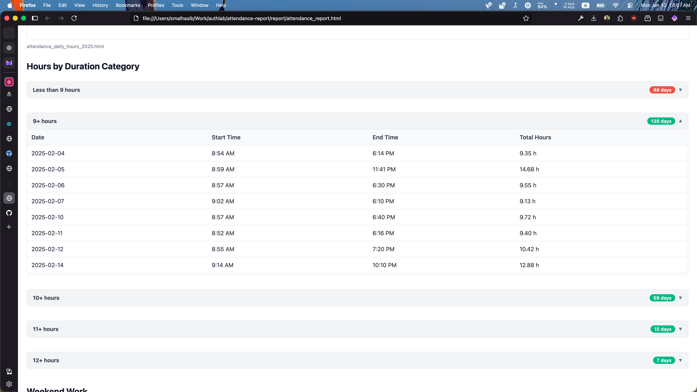
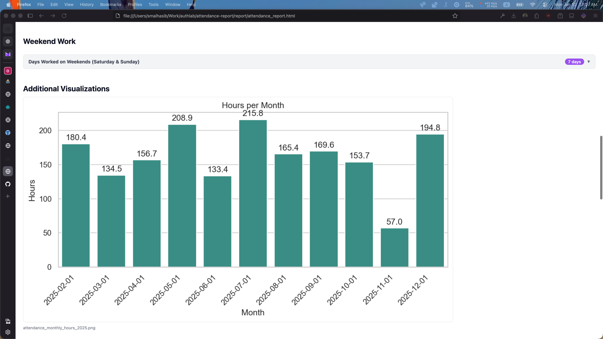
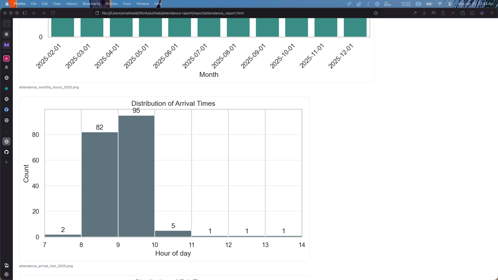
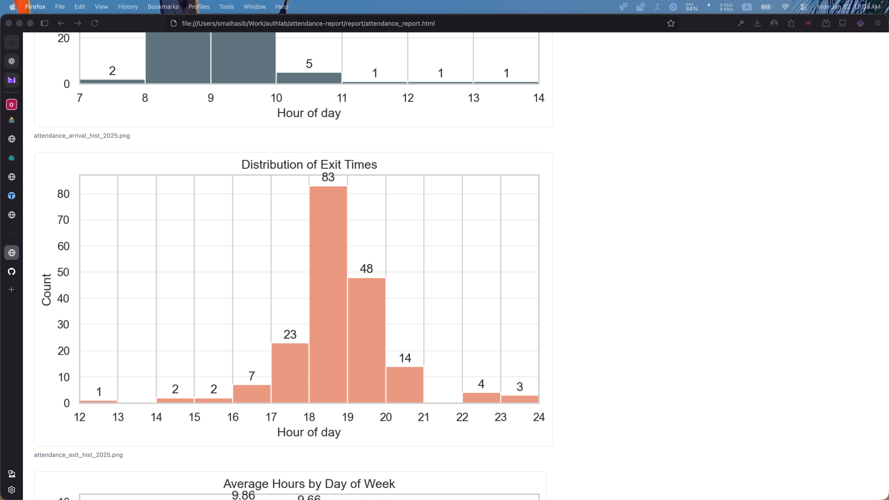
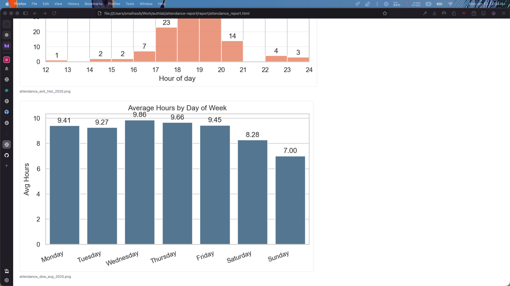
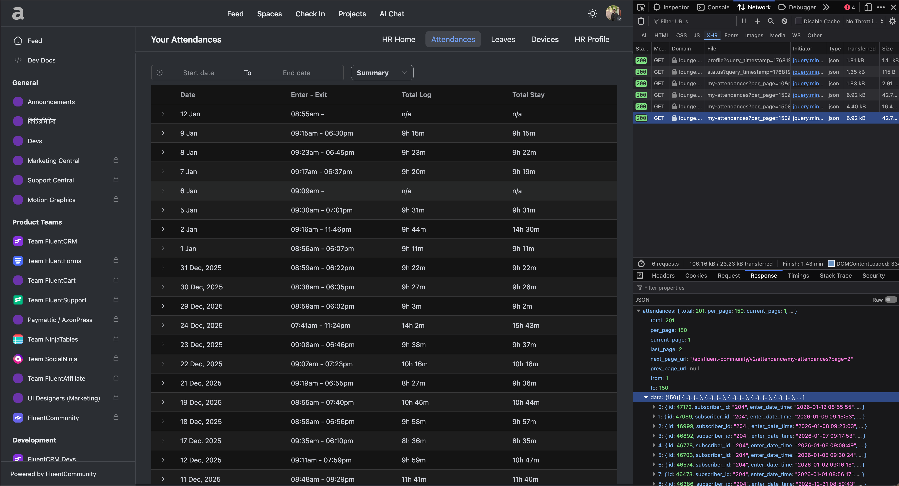

# Authlab Attendance Report Generator

Generate graphical attendance reports from Authlab attendance data.

## Screenshots

### Main Dashboard



### Daily Hours Chart (Interactive)



### Duration Categories & Weekend Work



### Monthly Hours & Yearly Comparison



### Arrival & Exit Time Distribution



### Average Hours by Day of Week



---

## Setup

### 1. Get Attendance Data from API

1. Open [Authlab Lounge](https://lounge.authlab.io) in your browser
2. Navigate to **HR Home** → **Attendances**
3. Open browser **Developer Tools** (F12 or Right-click → Inspect)
4. Go to the **Network** tab
5. Refresh the page or scroll to load attendance data
6. Look for API request: `my-attendances?per_page=150` (or similar)
7. Click on the request and go to **Response** tab
8. Copy the **entire JSON response** and save it to `authlab_attendences.json`



Example structure:

```json
{
  "data": [
    {
      "id": 46999,
      "subscriber_id": "204",
      "enter_date_time": "2026-01-08 09:23:03",
      "exit_date_time": "2026-01-08 18:30:00",
      "duration_minutes": "547",
      "status": "completed",
      ...
    }
  ]
}
```

> **Tip:** If you have more than 150 records, increase `per_page` parameter in the API URL (e.g., `per_page=500`) or paginate through multiple pages.

### 2. Create Virtual Environment

```bash
python3 -m venv venv
```

### 3. Activate Virtual Environment

**macOS/Linux:**

```bash
source venv/bin/activate
```

**Windows:**

```bash
venv\Scripts\activate
```

### 4. Install Dependencies

```bash
pip install -r requirements.txt
```

---

## Usage

### Run the Script

```bash
python3 generate_attendance_report.py
```

The report will be generated in the `report/` directory and automatically opened in your default browser.

---

## Output

The script generates:

| File                                       | Description                                  |
| ------------------------------------------ | -------------------------------------------- |
| `report/attendance_report.html`            | Main interactive HTML report                 |
| `report/attendance_daily_hours_*.html`     | Interactive daily hours chart (Plotly)       |
| `report/attendance_monthly_hours_*.png`    | Monthly hours bar chart                      |
| `report/attendance_yearly_comparison.png`  | Year-over-year comparison                    |
| `report/attendance_arrival_hist_*.png`     | Arrival time distribution                    |
| `report/attendance_exit_hist_*.png`        | Exit time distribution                       |
| `report/attendance_dow_avg_*.png`          | Average hours by day of week                 |

---

## Features

- ✅ **Daily hours tracking** with 9-hour target line
- 📊 **Monthly/Yearly breakdowns** with visual comparisons
- ⏰ **Arrival/Exit time distributions** histograms
- 📅 **Day-of-week analysis**
- 🏷️ **Duration categories** (Less than 9h, 9h+, 10h+, 11h+, 12h+)
- 🗓️ **Weekend work tracking**
- 📈 **Year-by-year comparison** charts
- 🔄 **Year filter dropdown** to view specific year data

---

## Requirements

- Python 3.8+
- See `requirements.txt` for dependencies:
  - pandas
  - seaborn
  - matplotlib
  - plotly
